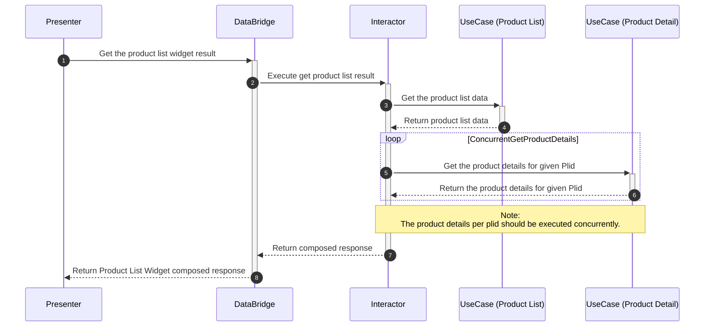

<h2 style="text-align: center;">The Multiple Products Challenge</h2>

#### Prerequisites
>This challenge requires you to make use of **Coroutines** to solve the problem and implement the business rules. An intuitive
> understanding of [Kotlin Coroutines](https://kotlinlang.org/docs/coroutines-basics.html) is therefore required before proceeding.
> 
> The architecture used in this problem is a flavor of [Uncle Bobs Clean Architecture](https://blog.cleancoder.com/uncle-bob/2012/08/13/the-clean-architecture.html) and having an understanding of these
> principles are required to correctly integrate your solution to the problem.

#### Problem Statement
You are working on an eCommerce Android app and the Product team would like you to implement a new feature!

The feature you will be expected to implement is a **Product List Widget**. This widget displays a list of products in a
horizontal scrolling list to the user. The folks over on the Platform team are working on the UI for this widget, and 
you have been given the task of fetching the data from the server.

The backend team has provided you with the following API Tech Spec:

##### [GET] Product List Endpoint
   1. This endpoint returns the Product List Widget title and a list of id's for each product in the list (known as a Plid).
   2. The machine learning team will return Product List Widgets based on the user id that is provided in the params of
     this call.
   ```json
   {
      "title": "Product List Widget Title",
      "plids": [
          "ID001",
          "ID002"
      ]  
   }
   ```

##### [GET] Product Details Endpoint
   1. This endpoint returns the Product Details for a given Plid.
   2. This endpoint does not support multiple Plids, therefore you will need to make a new service call per plid that you 
   require details for.
   ```json
   {
      "title": "Product Title Example",
      "subtitle": "Product Subtitle Example",
      "image": "https://media.example.com/product-image-url",
      "price": "R 599,99",
      "stock_count": 34
   }
   ```
Your team has provided you with some implemented classes and defined which classes you need to implement.

##### Provided classes
You have been provided with all the framework classes needed to make service calls, as well as all data models.

##### Required to implement
- Implement UseCase's to get the [product list](#get-product-list-endpoint) and to get the [product details](#get-product-details-endpoint) per plid. You'll need to first fetch the product list 
data from backend using the provided [repository](https://github.com/Kaylen-Pillay/coroutines-workshop/blob/main/src/main/kotlin/common/api/repository/impl/RepositoryProductListImpl.kt), thereafter you'll need to concurrently fetch the product details for 
all plids returned from the product list response. _Hint_: You might want to implement an Interactor to perform both actions.
- Implement the getProductList function in the DataBridge.

The following diagram illustrates the flow you are required to implement.



A possible solution has been provided under the `solution` package, however, do attempt the problem before looking at the solution.

There are two run configurations provided when running the project from IntelliJ Idea. 
- Run Challenge Exercise - This run config will execute your code added in the `exercise` package
- Run Challenge Solution - This run config will execute the solution under the `solution` package

GL HF! :dancer:
